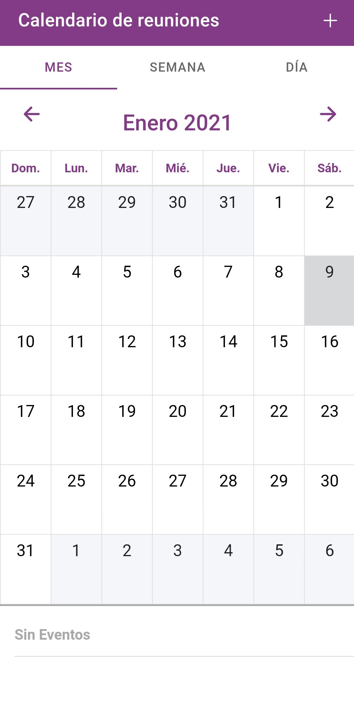
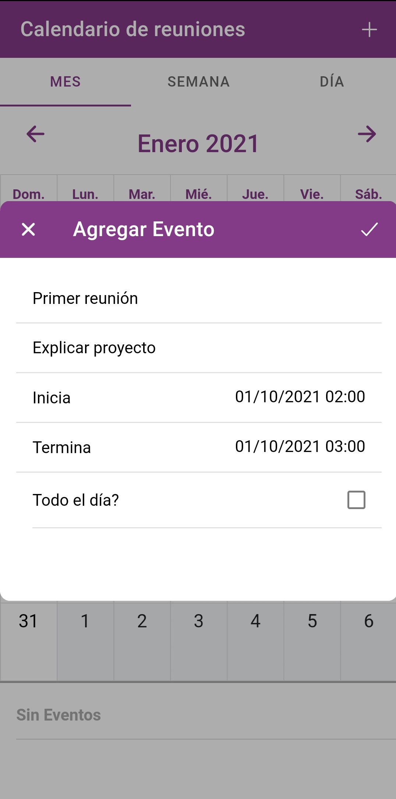
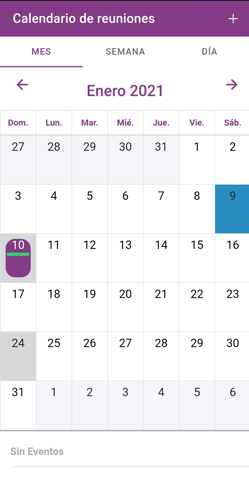
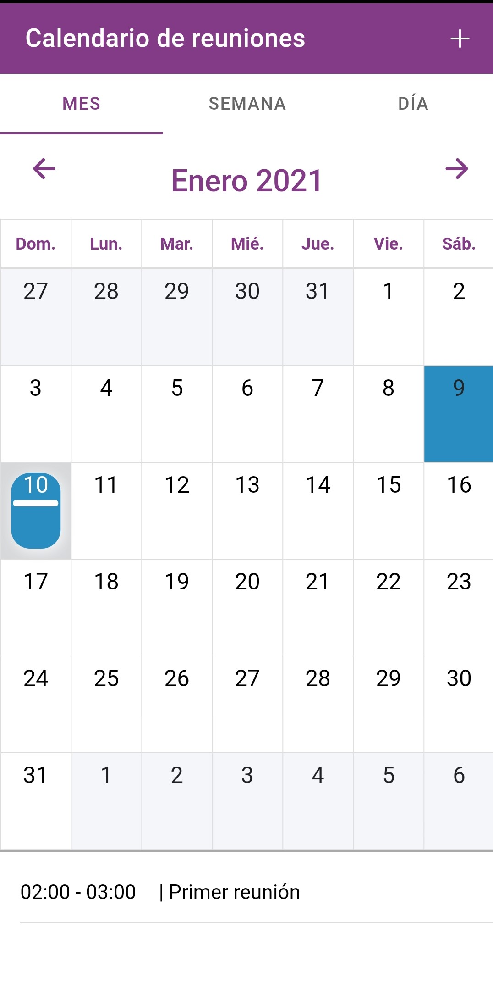
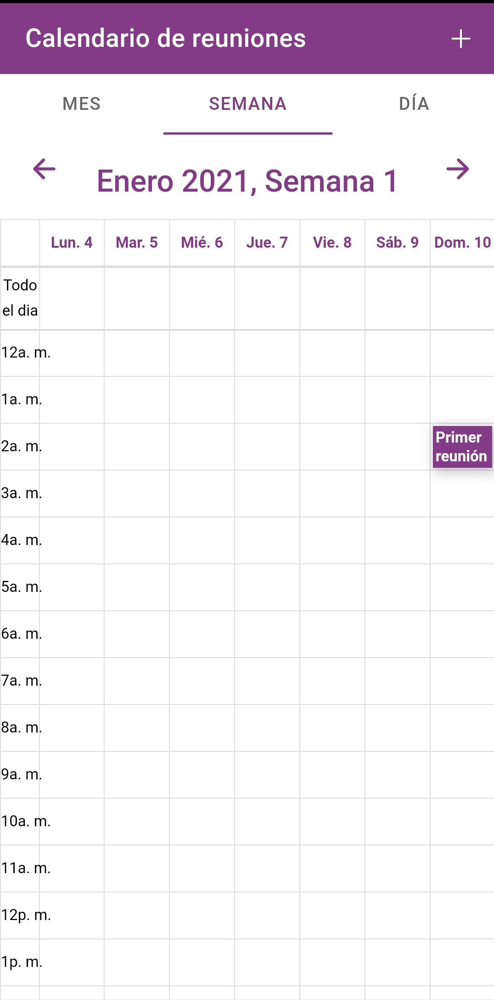
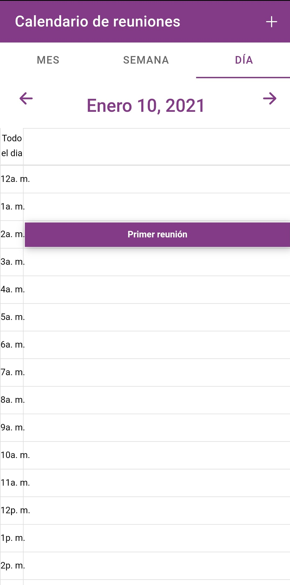
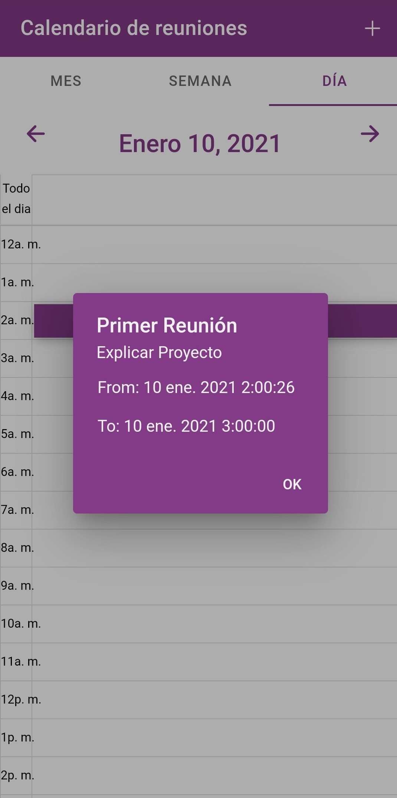

<!-- https://www.markdownguide.org/basic-syntax/#reference-style-links -->
[![MIT License][license-shield]][license-url]
[![LinkedIn][linkedin-shield]][linkedin-url]

<!-- PROJECT LOGO -->
<br />
<p align="center">
  <h3 align="center">Events Calendar 73</h3>

  <p align="center">
    A calendar to add events made with Ionic and Firebase Realtime Database
    <br />
  </p>
</p>


<!-- ABOUT THE PROJECT -->
## About The Project


### Built With


* [Ionic](https://ionicframework.com/)
* [Firebase Realtime Database](https://firebase.google.com/products/realtime-database)
* [Ionic2-Calendar](https://github.com/twinssbc/Ionic2-Calendar)


<!-- GETTING STARTED -->
## Getting Started


To get a local copy up and running follow these simple steps.

### Installation


1. Clone the repo
   ```sh
   git clone https://github.com/mmal73/meeting-planner-73.git
   ```
2. Install NPM packages
   ```sh
   npm install
   ```


<!-- USAGE EXAMPLES -->
## Usage


**Home:**

.

**Add Event:**

.

**Show Events:**

.

**Select an Event:**

.

**Week View:**

.

**Day View:**

.

**Event Detail:**

.

<!-- LICENSE -->
## License


Distributed under the MIT License. See `LICENSE` for more information.

<!-- ACKNOWLEDGEMENTS -->
## Acknowledgements
* [Img Shields](https://shields.io)
<!-- MARKDOWN LINKS -->
<!-- https://www.markdownguide.org/basic-syntax/#reference-style-links -->
[license-shield]: https://img.shields.io/github/license/github_username/repo.svg?style=for-the-badge
[license-url]: https://github.com/mmal73/meeting-planner-73/blob/main/LICENSE
[linkedin-shield]: https://img.shields.io/badge/-LinkedIn-black.svg?style=for-the-badge&logo=linkedincolorB=555
[linkedin-url]: https://www.linkedin.com/in/luis-antonio-mendoza-martinez-375895200/